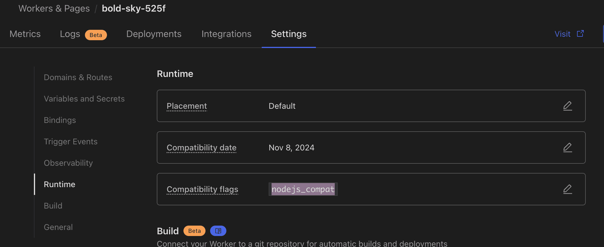

<!-- markdownlint-disable-file MD004 MD024 MD033 MD034 MD036 -->
# CHANGE LOG

<p align="center">
  <a href="CHANGELOG.md">中文</a> |
  <a href="CHANGELOG_EN.md">English</a>
</p>

## v1.8.0(main)

### Features

- feat: |Frontend| 前端新增 6 国语言支持（`zh` / `en` / `es` / `pt-BR` / `ja` / `de`），默认语言保持为 `zh`；无 locale 前缀路由（如 `/`、`/user`）默认使用中文渲染，同时会记录浏览器语言作为语言偏好。用户手动切换后会持久化语言偏好，并保持当前页面路径、查询参数与 canonical locale URL 一致
- feat: |API| 新增服务端解析邮件接口 `/api/parsed_mails` 与 `/api/parsed_mail/:id`，直接返回 `sender` / `subject` / `text` / `html` / `attachments` 元信息（复用 `commonParseMail`），AI agent 侧不再需要引入 MIME 解析器
- feat: |Skill| 新增仓库内置只读 skill `cf-temp-mail-agent-mail`（`skills/cf-temp-mail-agent-mail/`），让 OpenClaw / Codex / Cursor 等 AI agent 凭用户提供的 Address JWT + API 地址读取邮箱、轮询验证码，绕开创建邮箱时的 Turnstile 人机验证；可通过 `npx degit dreamhunter2333/cloudflare_temp_email/skills/cf-temp-mail-agent-mail` 安装
- docs: |文档| 新增"AI Agent 使用邮箱"文档（`guide/feature/agent-email`），说明 `parsed_mail` API 用法，并在 parsed API 不可用时给出对齐前端的 `mail-parser-wasm` + `postal-mime` 本地解析回退方案
- docs: |文档| 在 `quick-start` / `worker-vars` / `email-routing` 三个入口文档（中英文）显式补充"域名是部署前提条件"提示，强调需先在 Cloudflare 启用 Email Routing 并下发邮件 DNS 记录、Worker 部署后再绑定 Catch-all，子域名需单独启用，避免用户在没有可用域名时直接开始部署却收不到邮件（issue #1004）
- docs: |部署排障| 优化近期 issue 暴露的 UI 部署与升级排障文档：补充 `nodejs_compat`、D1 绑定名必须为 `DB`、`/open_api/settings` 校验、后端 API 地址填写、Cloudflare 安全挑战导致 `Network Error`、D1 容量上限与 Cron Trigger 自动清理、GitHub OAuth 公开邮箱、admin 管理口令与用户账号区别、随机二级域名 API 需传 `enableRandomSubdomain` 等说明；同时将帮助/FAQ 菜单移动到核心配置之后，提升可见性
- docs: |文档| 补充重新创建旧邮箱提示地址已存在时的处理方式，并完善 GitHub Actions 自动更新配合 Page Functions 转发后端请求的 workflow 说明（issues #947 #654）
- docs: |OAuth2| 补充 GitHub 私密邮箱登录配置，说明可使用 `https://api.github.com/user/emails`、JSONPath 邮箱字段和 `user:email` scope 获取主邮箱（issue #655）

### Bug Fixes

- fix: |Frontend| 收窄地址管理相关弹窗宽度，并让地址表格在弹窗内部横向滚动，避免多地址场景撑宽弹窗
- fix: |Frontend| 修复 `/open_api/settings` 未返回 `domains` 数组时前端设置初始化直接调用 `map()` 报 `undefined` 错误的问题，统一按空数组兜底处理
- fix: |Frontend| 修复前端在 `jwt` / `auth` / `adminAuth` 等 localStorage 凭据为空字符串、字面量 `"undefined"` 或包含换行/控制符时，请求构造的 `Authorization` 等头部抛出 `Invalid character in header content` 导致前端所有接口报错的问题（issue #1000）。新增 `safeHeaderValue` / `safeBearerHeader` 工具，对全部认证头做 RFC 7230 校验，不安全的值直接跳过该头部，让 worker 走标准 401 而不是请求级崩溃

### Improvements

- refactor: |Worker| 拆分 `mails_api/index.ts` 与 `admin_api/index.ts`，入口只负责挂路由，业务拆到各自的 `*_api.ts` 文件（`mails_crud.ts` / `new_address.ts` / `parsed_mail_api.ts` / `address_api.ts` / `address_sender_api.ts` / `sendbox_api.ts` / `statistics_api.ts` / `account_settings_api.ts`），保持路径与行为不变
- chore: |CI| 将 Codium PR Agent 的 `CONFIG.MODEL` 与 `CONFIG.MODEL_TURBO` 调整为 `gpt-5.4-nano`

## v1.7.0

### Breaking Changes

- breaking: |发信| `SEND_MAIL` 的语义已从“仅用于 `verifiedAddressList` 命中的兼容发信路径”调整为“常规兜底发信通道”。如果实例已绑定 `SEND_MAIL` 且未配置 Resend/SMTP，升级后未命中 `verifiedAddressList` 的收件人也会直接通过 Cloudflare binding 发出，发信行为与成本路径会发生变化

### Features

- feat: |发信| 推荐使用 Cloudflare `send_email` binding 作为默认发信通道，已 onboard Email Routing 的域名未配置 Resend/SMTP 时自动走 binding 发至任意地址（Workers Paid 每月含 3000 封，超出 $0.35/1000 封）；历史 `verifiedAddressList` / Resend / SMTP 配置完全兼容（#964）

### Bug Fixes

- fix: |发送邮件| 当 `DEFAULT_SEND_BALANCE > 0` 时，首次访问发信设置或调用发信接口会为缺少 `address_sender` 记录的地址自动初始化默认额度（`ON CONFLICT DO NOTHING`），用户不再需要先手动申请发信权限；已存在的记录（包括管理员禁用或手动设置的行）一律保持原样，runtime 不会覆盖（#925 #985）
- fix: |用户侧收件箱| 修复 `ENABLE_USER_DELETE_EMAIL` 关闭时用户中心仍显示删除按钮且仍可通过 `/user_api/mails/:id` 删除邮件的问题（#978）
- fix: |Address| 创建邮箱时统一将配置的前缀转为小写，避免生成包含大写前缀的地址；历史数据需用户自行迁移为小写（#930）

### Improvements

## v1.6.0

### Features

- feat: |Admin| IP 黑名单设置新增 **IP 白名单（严格模式）**：启用后仅允许匹配白名单的 IP 访问受限流保护的 API（创建邮箱、发送邮件、外部发送邮件、用户注册、验证码校验），其他所有 IP 一律拒绝（#920）
- feat: |Address| 支持最大地址数量设置为 `0` 表示无限制（#968）

### Bug Fixes

- fix: |Admin| 修复 `/admin/address` 与 `/admin/users` 在使用完整邮箱（query 长度超过 50 字节）作为搜索条件时报错 `D1_ERROR: LIKE or GLOB pattern too complex` 的问题，长查询自动改用 `instr()` 绕开 D1 的 LIKE pattern 长度限制（#956）

### Improvements

- docs: |发送邮件 API| 明确 `/api/send_mail` 与 `/external/api/send_mail` 两个端点的认证方式差异，补充"地址 JWT"概念说明（#922）
- docs: |Worker 变量| `JWT_SECRET` 补充生成方式说明（`openssl rand -hex 32`）（#932）
- docs: |CLI 部署| `routes` 自定义域名配置增加用途说明（#932）
- docs: |Admin API| `/admin/new_address` 返回值文档补充 `address_id` 字段（#912）
- docs: |Admin| 补充管理后台账号列表排序功能说明（#918）
- docs: |Pages 部署| 补充 SPA 模式说明，避免刷新页面或直接访问子路径时 404（#813）
- docs: |侧边栏| 重组文档侧边栏结构，拆分为"核心配置"、"通知与集成"、"高级功能"、"管理后台"等分组
- docs: |FAQ| 大幅扩充常见问题，新增 SPA 404、发信余额、SMTP_CONFIG 配置、邮件客户端登录等高频问题（#919, #925, #839, #715, #921, #609）
- docs: |发送邮件| 增强 SMTP_CONFIG 字段说明和多域名示例，新增发信余额机制说明
- docs: |Email Routing| 补充子域名需单独启用 Email Routing 的说明，避免仅在一级域名开启导致子域收不到邮件（#969）

## v1.5.0

### Features

- feat: |Admin| 管理后台账号列表支持按列排序（ID、名称、创建时间、更新时间、邮件数量、发送数量），搜索时自动重置分页到第1页（#918）
- feat: |Admin API| `/admin/new_address` 接口返回值新增 `address_id` 字段，避免创建后需再次查询地址 ID（#912）
- feat: |创建邮箱| 新增 `ENABLE_CREATE_ADDRESS_SUBDOMAIN_MATCH` 开关，并支持在管理后台单独控制创建邮箱 API 的子域名后缀匹配；开启后允许 `foo.example.com` 匹配基础域名 `example.com`
- feat: |自动回复| 发件人过滤支持正则表达式匹配，使用 `/pattern/` 语法（如 `/@example\.com$/`），同时保持前缀匹配的向后兼容
- feat: |Turnstile| 新增全局登录表单 Turnstile 人机验证，通过 `ENABLE_GLOBAL_TURNSTILE_CHECK` 环境变量控制（#767）
- feat: |Telegram| Telegram 推送支持发送邮件附件（单文件限制 50MB），多附件通过 `sendMediaGroup` 批量发送，通过 `ENABLE_TG_PUSH_ATTACHMENT` 环境变量开启（#894）
- feat: |邮件存储| 支持通过 `ENABLE_MAIL_GZIP` 变量启用 Gzip 压缩邮件存储（#823）
  - 启用前需先执行数据库迁移：`Admin -> 快速设置 -> 数据库 -> 升级数据库 Schema`，或调用接口 `POST /admin/db_migration`
  - 新邮件写入 `raw_blob`，兼容读取 `raw` / `raw_blob`；压缩与解压会增加 CPU 开销，建议付费 Worker Plan 再开启

### Bug Fixes

- fix: |自动回复| 修复 `source_prefix` 为空字符串时自动回复不触发的问题（#459），空值现在正确匹配所有发件人
- fix: |OAuth2| 修复 Android via 浏览器等移动端 OAuth2 登录时 sessionStorage 丢失导致回调失败的问题，新增 localStorage 兜底（#900）
- fix: |IMAP| 修复嵌套回复邮件乱码、Gmail 空 Content-Type 头解析失败、缺失 Date 头及 locale 依赖日期格式等问题

### Testing

- test: |E2E| 新增创建邮箱子域名匹配测试，覆盖默认精确匹配、后台开启后生效，以及 env=false 的硬禁用优先级
- test: |E2E| 新增自动回复触发 E2E 测试，覆盖空前缀、前缀匹配、正则匹配和禁用状态场景

### Docs

- docs: |创建邮箱| 补充创建邮箱 API / Worker 变量 / 子域名文档，说明“直接指定子域名”和“随机子域名”两种能力的区别
- docs: |API| 新增地址 JWT 与用户 JWT 的区分说明，避免混淆两种认证方式；调整文档菜单结构，将 API 接口文档归类到独立分组（#910）
- docs: |Telegram| 新增每用户邮件推送和全局推送功能说明文档（#769）
- docs: |Webhook| 新增 Telegram Bot、企业微信、Discord 等常用推送平台的 Webhook 模板示例
- feat: |Webhook| 前端预设模板新增 Telegram Bot、企业微信、Discord 三个模板

### Improvements

## v1.4.0

### Features

- feat: |用户注册| 新增用户注册邮箱正则校验功能，管理员可配置邮箱格式验证规则
- feat: |前端| 新增可配置的 Status 菜单按钮，通过 `STATUS_URL` 环境变量配置状态监控页面链接
- feat: |SMTP| SMTP 代理服务支持 STARTTLS，通过 `smtp_tls_cert` 和 `smtp_tls_key` 环境变量配置
- feat: |Webhook| Webhook 设置页面新增预设模板下拉菜单，支持 Message Pusher、Bark、ntfy 一键填充配置

### Bug Fixes

- fix: |Telegram| 修复 admin 用户通过 Telegram MiniApp 查看邮件时报 `Auth date expired` 的问题，支持 admin 密码认证查看邮件
- fix: |Admin API| 修复 `/admin/account_settings` 在未配置 KV 且 `fromBlockList` 为空时触发 `Cannot read properties of undefined (reading 'put')` 的问题
- fix: |数据库| 修复 `DB_INIT_QUERIES` 缺少 `idx_raw_mails_message_id` 索引导致 `UPDATE raw_mails ... WHERE message_id = ?` 全表扫描的问题，同步 `schema.sql` 与初始化代码，新增 v0.0.6 迁移逻辑
- fix: |文档| 修复 User Mail API 文档中错误使用 `x-admin-auth` 的问题，改为正确的 `x-user-token`
- fix: |前端| 修复暗色主题下邮件内容文字看不清的问题，优化纯文本邮件和 Shadow DOM 渲染的暗色模式样式
- docs: |文档| 新增 Admin 删除邮件、删除邮箱地址、清空收件箱、清空发件箱 API 文档
- fix: |前端| 修复回复 HTML 格式邮件时丢失原邮件 HTML 内容的问题，优先使用 HTML 原文而非纯文本
- fix: |安全| 修复回复/转发邮件时的 XSS 风险，使用 DOMPurify 对 HTML 内容进行白名单消毒，对纯文本内容进行 HTML 转义
- fix: |API| 修复 `requset_send_mail_access` API 路径拼写错误，改为 `request_send_mail_access`

### Testing

- test: |E2E| 新增 Docker 化端到端测试环境（Playwright + Mailpit），`cd e2e && npm test` 一条命令运行
- test: |E2E| 覆盖 API 健康检查、地址生命周期、SMTP 发信、收件箱 UI、回复 HTML 邮件及 XSS 防护
- test: |Worker| 新增 `/admin/test/seed_mail` 测试端点，仅 `E2E_TEST_MODE` 启用时可用

### Improvements

- style: |邮件列表| 优化收件箱和发件箱空状态显示，根据邮件数量显示不同提示信息，添加语义化图标
- feat: |后台管理| 邮箱地址列表来源IP添加 ip.im 查询链接，点击可快速查看IP信息
- docs: |文档| 修复 VitePress 中英文切换路径错误，改用双前缀 locale 配置
- feat: |IMAP 代理| 重构 IMAP 服务端，拆分为独立模块（HTTP 客户端、邮箱、消息），使用 `deferToThread` 异步 HTTP 避免阻塞 Twisted reactor，使用后端 `id` 作为稳定 UID，新增 STARTTLS 支持、LRU 消息缓存、session 级 flags 管理、SEARCH 命令支持、JWT 凭证和地址+密码双登录方式，新增完整测试套件
- fix: |IMAP 代理| 修复 `getHeaders()` 过滤逻辑、`store()` 崩溃问题
- fix: |邮件解析| 修复 `parse_email.py` 中使用私有属性 `_payload` 导致编码错误的问题，改用 `get_payload(decode=True)` 正确解码邮件体

## v1.3.0

### Features

- feat: |OAuth2| 新增 OAuth2 邮箱格式转换功能，支持通过正则表达式转换第三方登录返回的邮箱格式（如将 `user@domain` 转换为 `user@custom.domain`）
- feat: |OAuth2| 新增 OAuth2 提供商 SVG 图标支持，管理员可为登录按钮配置自定义图标，预置 GitHub、Linux Do、Authentik 模板图标
- feat: |发送邮件| 未配置发送邮件功能时自动隐藏发送邮件 tab、发件箱 tab 和回复按钮

### Bug Fixes

- fix: |用户地址| 修复禁止匿名创建时，已登录用户地址数量限制检查失效的问题，新增公共函数 `isAddressCountLimitReached` 统一处理地址数量限制逻辑

### Improvements

- refactor: |代码重构| 提取地址数量限制检查为公共函数，优化代码复用性
- perf: |性能优化| GET 请求中的地址活动时间更新改为异步执行，使用 `waitUntil` 不阻塞响应

## v1.2.1

### Bug Fixes

- fix: |定时任务| 修复定时任务清理报错 `e.get is not a function`，使用可选链安全访问 Context 方法

### Improvements

- style: |AI 提取| 暗色模式下 AI 提取信息使用更柔和的蓝色 (#A8C7FA)，减少视觉疲劳

## v1.2.0

### Breaking Changes

- |数据库| 新增 `source_meta` 字段，需执行 `db/2025-12-27-source-meta.sql` 更新数据库或到 admin 维护页面点击数据库更新按钮

### Features

- feat: |Admin| 新增管理员账号页面，显示当前登录方式并支持退出登录（仅限密码登录方式）
- fix: |GitHub Actions| 修复容器镜像名需要全部小写的问题
- feat: |邮件转发| 新增来源地址正则转发功能，支持按发件人地址过滤转发，完全向后兼容
- feat: |地址来源| 新增地址来源追踪功能，记录地址创建来源（Web 记录 IP，Telegram 记录用户 ID，Admin 后台标记）
- feat: |邮件过滤| 移除后端 keyword 参数，改为前端过滤当前页邮件，优化查询性能
- feat: |前端| 地址切换统一为下拉组件，极简模式支持切换，主页提供地址管理入口
- feat: |数据库| 为 `message_id` 字段添加索引，优化邮件更新操作性能，需执行 `db/2025-12-15-message-id-index.sql` 更新数据库
- feat: |Admin| 维护页面增加自定义 SQL 清理功能，支持定时任务执行自定义清理语句
- feat: |国际化| 后端 API 错误消息全面支持中英文国际化
- feat: |Telegram| 机器人支持中英文切换，新增 `/lang` 命令设置语言偏好

## v1.1.0

- feat: |AI 提取| 增加 AI 邮件识别功能，使用 Cloudflare Workers AI 自动提取邮件中的验证码、认证链接、服务链接等重要信息
  - 支持优先级提取：验证码 > 认证链接 > 服务链接 > 订阅链接 > 其他链接
  - 管理员可配置地址白名单（支持通配符，如 `*@example.com`）
  - 前端列表和详情页展示提取结果
  - 需要配置 `ENABLE_AI_EMAIL_EXTRACT` 环境变量和 AI 绑定
  - 需要执行 `db/2025-12-06-metadata.sql` 文件中的 SQL 更新 `D1` 数据库 或者到 admin维护页面点击数据库更新按钮
- feat: |Admin| 维护页面增加清理 n 天前空邮件的邮箱地址功能
- fix: 修复自定义认证密码功能异常的问题 (前端属性名错误 & /open_api 接口被拦截)

## v1.0.7

- feat: |Admin| 新增 IP 黑名单功能，用于限制访问频率较高的 API
- feat: |Admin| 新增 ASN 组织黑名单功能，支持基于 ASN 组织名称过滤请求（支持文本匹配和正则表达式）
- feat: |Admin| 新增浏览器指纹黑名单功能，支持基于浏览器指纹过滤请求（支持精确匹配和正则表达式）

## v1.0.6

- feat: |DB| update db schema add index
- feat: |地址密码| 增加地址密码登录功能, 通过 `ENABLE_ADDRESS_PASSWORD` 配置启用, 需要执行 `db/2025-09-23-patch.sql` 文件中的 SQL 更新 `D1` 数据库
- fix: |GitHub Actions| 修复 debug 模式配置，仅当 DEBUG_MODE 为 'true' 时才启用调试模式
- feat: |Admin| 账户管理页面新增多选批量操作功能（批量删除、批量清空收件箱、批量清空发件箱）
- feat: |Admin| 维护页面增加清理未绑定用户地址的功能
- feat: 支持针对角色配置不同的绑定地址数量上限, 可在 admin 页面配置

## v1.0.5

- feat: 新增 `DISABLE_CUSTOM_ADDRESS_NAME` 配置: 禁用自定义邮箱地址名称功能
- feat: 新增 `CREATE_ADDRESS_DEFAULT_DOMAIN_FIRST` 配置: 创建地址时优先使用第一个域名
- feat: |UI| 主页增加进入极简模式按钮
- feat: |Webhook| 增加白名单开关功能，支持灵活控制访问权限

## v1.0.4

- feat: |UI| 优化极简模式主页, 增加全部邮件页面功能(删除/下载/附件/...), 可在 `外观` 中切换
- feat: admin 账号设置页面增加 `邮件转发规则` 配置
- feat: admin 账号设置页面增加 `禁止接收未知地址邮件` 配置
- feat: 邮件页面增加 上一封/下一封 按钮

## v1.0.3

- fix: 修复 github actions 部署问题
- feat: telegram /new 不指定域名时, 使用随机地址

## v1.0.2

- fix: 修复 oauth2 登录失败的问题

## v1.0.1

- feat: |UI| 增加极简模式主页, 可在 `外观` 中切换
- fix: 修复 oauth2 登录时，default role 不生效的问题

## v1.0.0

- fix: |UI| 修复 User 查看收件箱，不选择地址时，关键词查询不生效
- fix: 修复自动清理任务，时间为 0 时不生效的问题
- feat: 清理功能增加 创建 n 天前地址清理，n 天前未活跃地址清理
- fix: |IMAP Proxy| 修复 IMAP Proxy 服务器，无法查看新邮件的问题

## v0.10.0

- feat: 支持 User 查看收件箱，`/user_api/mails` 接口, 支持 `address` 和 `keyword` 过滤
- fix: 修复 Oauth2 登录获取 Token 时，一些 Oauth2 需要 `redirect_uri` 参数的问题
- feat: 用户访问网页时，如果 `user token` 在 7 天内过期，自动刷新
- feat: admin portal 中增加初始化 db 的功能
- feat: 增加 `ALWAYS_SHOW_ANNOUNCEMENT` 变量，用于配置是否总是显示公告

## v0.9.1

- feat: |UI| support google ads
- feat: |UI| 使用 shadow DOM 防止样式污染
- feat: |UI| 支持 URL jwt 参数自动登录邮箱，jwt 参数会覆盖浏览器中的 jwt
- fix: |CleanUP| 修复清理邮件时，清理时间超过 30 天报错的 bug
- feat: admin 用户管理页面: 增加 用户地址查看功能
- feat: | S3 附件| 增加 S3 附件删除功能
- feat: | Admin API| 增加 admin 绑定用户和地址的 api
- feat: | Oauth2 | Oatuh2 获取用户信息时，支持 `JSONPATH` 表达式

## v0.9.0

- feat: | Worker | 支持多语言
- feat: | Worker | `NO_LIMIT_SEND_ROLE` 配置支持多角色, 逗号分割
- feat: | Actions | build 里增加 `worker-with-wasm-mail-parser.zip` 支持 UI 部署带 `wasm` 的 worker

## v0.8.7

- fix: |UI| 修复移动设备日期显示问题
- feat: |Worker| 支持通过 `SMTP` 发送邮件, 使用 [zou-yu/worker-mailer](https://github.com/zou-yu/worker-mailer/blob/main/README_zh-CN.md)

## v0.8.6

- feat: |UI| 公告支持 html 格式
- feat: |UI| `COPYRIGHT` 支持 html 格式
- feat: |Doc| 优化部署文档，补充了 `Github Actions 部署文档`，增加了 `Worker 变量说明`

## v0.8.5

- feat: |mail-parser-wasm-worker| 修复 `initSync` 函数调用时的 `deprecated` 参数警告
- feat: rpc headers covert & typo (#559)
- fix: telegram mail page use iframe show email (#561)
- feat: |Worker| 增加 `REMOVE_ALL_ATTACHMENT` 和 `REMOVE_EXCEED_SIZE_ATTACHMENT` 用于移除邮件附件，由于是解析邮件的一些信息会丢失，比如图片等.

## v0.8.4

- fix: |UI| 修复 admin portal 无收件人邮箱删除调用api 错误
- feat: |Telegram Bot| 增加 telegram bot 清理无效地址凭证命令
- feat: 增加 worker 配置 `DISABLE_ANONYMOUS_USER_CREATE_EMAIL` 禁用匿名用户创建邮箱地址，只允许登录用户创建邮箱地址
- feat: 增加 worker 配置 `ENABLE_ANOTHER_WORKER` 及 `ANOTHER_WORKER_LIST` ，用于调用其他 worker 的 rpc 接口 (#547)
- feat: |UI| 自动刷新配置保存到浏览器，可配置刷新间隔
- feat: 垃圾邮件检测增加存在时才检查的列表 `JUNK_MAIL_CHECK_LIST` 配置
- feat: | Worker | 增加 `ParsedEmailContext` 类用于缓存解析后的邮件内容，减少解析次数
- feat: |Github Action| Worker 部署增加 `DEBUG_MODE` 输出日志, `BACKEND_USE_MAIL_WASM_PARSER` 配置是否使用 wasm 解析邮件

## v0.8.3

- feat: |Github Action| 增加自动更新并部署功能
- feat: |UI| admin 用户设置，支持 oauth2 配置的删除
- feat: 增加垃圾邮件检测必须通过的列表 `JUNK_MAIL_FORCE_PASS_LIST` 配置

## v0.8.2

- fix: |Doc| 修复文档中的一些错误
- fix: |Github Action| 修复 frontend 部署分支错误的问题
- feat: admin 发送邮件功能
- feat: admin 后台，账号配置页面添加无限发送邮件的地址列表

## v0.8.1

- feat: |Doc| 更新 UI 安装的文档
- feat: |UI| 对用户隐藏邮箱账号的 ID
- feat: |UI| 增加邮件详情页的 `转发` 按钮

## v0.8.0

- feat: |UI| 随机生成地址时不超过最大长度
- feat: |UI| 邮件时间显示浏览器时区，可在设置中切换显示为 UTC 时间
- feat: 支持转移邮件到其他用户

## v0.7.6

### Breaking Changes

UI 部署 worker 需要点击 Settings -> Runtime, 修改 Compatibility flags, 增加 `nodejs_compat`



### Changes

- feat: 支持提前设置 bot info, 降低 telegram 回调延迟 (#441)
- feat: 增加 telegram mini app 的 build 压缩包
- feat: 增加是否启用垃圾邮件检查 `ENABLE_CHECK_JUNK_MAIL` 配置

## v0.7.5

- fix: 修复 `name` 的校验检查

## v0.7.4

- feat: UI 列表页面增加最小宽度
- fix: 修复 `name` 的校验检查
- fix: 修复 `DEFAULT_DOMAINS` 配置为空不生效的问题

## v0.7.3

- feat: worker 增加 `ADDRESS_CHECK_REGEX`, address name 的正则表达式, 只用于检查，符合条件将通过检查
- fix: UI 修复登录页面 tab 激活图标错位
- fix: UI 修复 admin 页面刷新弹框输入密码的问题
- feat: support `Oath2` 登录, 可以通过 `Github` `Authentik` 等第三方登录, 详情查看 [OAuth2 第三方登录](https://temp-mail-docs.awsl.uk/zh/guide/feature/user-oauth2.html)

## v0.7.2

### Breaking Changes

`webhook` 的结构增加了 `enabled` 字段，已经配置了的需要重新在页面开启并保存。

### Changes

- fix: worker 增加 `NO_LIMIT_SEND_ROLE` 配置, 加载失败的问题
- feat: worker 增加 `# ADDRESS_REGEX = "[^a-z.0-9]"` 配置, 替换非法符号的正则表达式，如果不设置，默认为 [^a-z0-9], 需谨慎使用, 有些符号可能导致无法收件
- feat: worker 优化 webhook 逻辑, 支持 admin 配置全局 webhook, 添加 `message pusher` 集成示例

## v0.7.1

- fix: 修复用户角色加载失败的问题
- feat: admin 账号设置增加来源邮件地址黑名单配置

## v0.7.0

### Breaking Changes

DB changes: 增加用户 `passkey` 表, 需要执行 `db/2024-08-10-patch.sql` 更新 `D1` 数据库

### Changes

- Docs: Update new-address-api.md (#360)
- feat: worker 增加 `ADMIN_USER_ROLE` 配置, 用于配置管理员用户角色，此角色的用户可访问 admin 管理页面 (#363)
- feat: worker 增加 `DISABLE_SHOW_GITHUB` 配置, 用于配置是否显示 github 链接
- feat: worker 增加 `NO_LIMIT_SEND_ROLE` 配置, 用于配置可以无限发送邮件的角色
- feat: 用户增加 `passkey` 登录方式, 用于用户登录, 无需输入密码
- feat: worker 增加 `DISABLE_ADMIN_PASSWORD_CHECK` 配置, 用于配置是否禁用 admin 控制台密码检查, 若你的网站只可私人访问，可通过此禁用检查

## v0.6.1

- pages github actions && 修复清理邮件天数为 0 不生效 by @tqjason (#355)
- fix: imap proxy server 不支持 密码 by @dreamhunter2333 (#356)
- worker 新增 `ANNOUNCEMENT` 配置, 用于配置公告信息 by @dreamhunter2333 (#357)
- fix: telegram bot 新建地址默认选择第一个域名 by @dreamhunter2333 (#358)

## v0.6.0

### Breaking Changes

DB changes: 增加用户角色表, 需要执行 `db/2024-07-14-patch.sql` 更新 `D1` 数据库

### Changes

worker 配置文件新增 `DEFAULT_DOMAINS`, `USER_ROLES`, `USER_DEFAULT_ROLE`, 具体查看文档 [worker配置](https://temp-mail-docs.awsl.uk/zh/guide/cli/worker.html#%E4%BF%AE%E6%94%B9-wrangler-toml-%E9%85%8D%E7%BD%AE%E6%96%87%E4%BB%B6)

- 移除 `apiV1` 相关代码和相关的数据库表
- 更新 `admin/statistics` api, 添加用户统计信息
- 更新地址的规则，只允许小写+数字，对于历史的地址在查询邮件时会进行 `lowercase` 处理
- 增加用户角色功能，`admin` 可以设置用户角色(目前可配置每个角色域名和前缀)
- admin 页面搜索优化, 回车自动搜索, 输入内容自动 trim

## v0.5.4

- 点击 logo 5 次进入 admin 页面
- 修复 401 时无法跳转登录页面(admin 和 网站认证)

## v0.5.3

- 修复 smtp imap proxy sever 的一些 bug
- 完善用户/admin 删除收件箱/发件箱的功能
- admin 可以删除 发件权限记录
- 添加中文邮件别名配置 `DOMAIN_LABELS` [文档](https://temp-mail-docs.awsl.uk/zh/guide/cli/worker.html)
- 移除 `mail channels` 相关代码
- github actions 增加 `FRONTEND_BRANCH` 变量用于指定部署的分支 (#324)

## v0.5.1

- 添加 `mail-parser-wasm-worker` 用于 worker 解析邮件, [文档](https://temp-mail-docs.awsl.uk/zh/guide/feature/mail_parser_wasm_worker.html)
- 添加校验用户邮箱长度配置 `MIN_ADDRESS_LEN` 和 `MAX_ADDRESS_LEN`
- 修复 `pages function` 未转发 `telegram` api 问题

## v0.5.0

- UI: 增加本地缓存进行地址管理
- worker: 增加 `FORWARD_ADDRESS_LIST` 全局邮件转发地址(等同于 `catch all`)
- UI: 多语言使用路由进行切换
- 添加保存附件到 S3 的功能
- UI: 增加收取邮件列表 `批量删除` 和 `批量下载`

## v0.4.6

- worker 配置文件添加 `TITLE = "Custom Title"`, 可自定义网站标题
- 修复 KV 未绑定无法删除地址的问题

## v0.4.5

- UI lazy load 懒加载
- telegram bot 添加用户全局推送功能(admin 用户)
- 增加对 cloudflare verified 用户发送邮件
- 增加使用 `resend` 发送邮件, `resend` 提供 http 和 smtp api, 使用更加方便, 文档: https://temp-mail-docs.awsl.uk/zh/guide/config-send-mail.html

## v0.4.4

- 增加 telegram mini app
- telegram bot 增加 `ubind`, `delete` 指令
- 修复 webhook 多行文本的问题

## v0.4.3

### Breaking Changes

配置文件 `main = "src/worker.js"` 改为 `main = "src/worker.ts"`

### Changes

- `telegram bot`  白名单配置
- `ENABLE_WEBHOOK` 添加 webhook
- UI: admin 页面使用双层 tab
- UI: 登录后可直接主页切换地址
- UI: 发件箱也采用左右分栏显示(类似收件箱)
- `SMTP IMAP Proxy` 添加发件箱查看

* feat: telegram bot TelegramSettings && webhook by @dreamhunter2333 in https://github.com/dreamhunter2333/cloudflare_temp_email/pull/244
* fix build by @dreamhunter2333 in https://github.com/dreamhunter2333/cloudflare_temp_email/pull/245
* feat: UI changes by @dreamhunter2333 in https://github.com/dreamhunter2333/cloudflare_temp_email/pull/247
* feat: SMTP IMAP Proxy: add sendbox && UI: sendbox use split view by @dreamhunter2333 in https://github.com/dreamhunter2333/cloudflare_temp_email/pull/248

## v0.4.2

- 修复 smtp imap proxy sever 的一些 bug
- 修复 UI 界面文字错误, 界面增加版本号
- 增加  telegram bot 文档 https://temp-mail-docs.awsl.uk/zh/guide/feature/telegram.html

* fix: imap server by @dreamhunter2333 in https://github.com/dreamhunter2333/cloudflare_temp_email/pull/227
* fix: Maintenance wrong label by @dreamhunter2333 in https://github.com/dreamhunter2333/cloudflare_temp_email/pull/229
* feat: add version for frontend && backend by @dreamhunter2333 in https://github.com/dreamhunter2333/cloudflare_temp_email/pull/230
* feat: add page functions proxy to make response faster by @dreamhunter2333 in https://github.com/dreamhunter2333/cloudflare_temp_email/pull/234
* feat: add about page by @dreamhunter2333 in https://github.com/dreamhunter2333/cloudflare_temp_email/pull/235
* feat: remove mailV1Alert && fix mobile showSideMargin by @dreamhunter2333 in https://github.com/dreamhunter2333/cloudflare_temp_email/pull/236
* feat: telegram bot by @dreamhunter2333 in https://github.com/dreamhunter2333/cloudflare_temp_email/pull/238
* fix: remove cleanup address due to many table need to be clean by @dreamhunter2333 in https://github.com/dreamhunter2333/cloudflare_temp_email/pull/240
* feat: docs: Telegram Bot by @dreamhunter2333 in https://github.com/dreamhunter2333/cloudflare_temp_email/pull/241
* fix: smtp_proxy: cannot decode 8bit && tg bot new random address by @dreamhunter2333 in https://github.com/dreamhunter2333/cloudflare_temp_email/pull/242
* fix: smtp_proxy: update raise imap4.NoSuchMailbox by @dreamhunter2333 in https://github.com/dreamhunter2333/cloudflare_temp_email/pull/243

### v0.4.1

- 用户名限制最长30个字符
- 修复 `/external/api/send_mail` 未返回的 bug (#222)
- 添加 `IMAP proxy` 服务，支持 `IMAP` 查看邮件
- UI 界面增加版本号显示

* feat: use common function handleListQuery when query by page by @dreamhunter2333 in https://github.com/dreamhunter2333/cloudflare_temp_email/pull/220
* fix: typos by @lwd-temp in https://github.com/dreamhunter2333/cloudflare_temp_email/pull/221
* fix: name max 30 && /external/api/send_mail not return result by @dreamhunter2333 in https://github.com/dreamhunter2333/cloudflare_temp_email/pull/222
* fix: smtp_proxy_server support decode from mail charset by @dreamhunter2333 in https://github.com/dreamhunter2333/cloudflare_temp_email/pull/223
* feat: add imap proxy server by @dreamhunter2333 in https://github.com/dreamhunter2333/cloudflare_temp_email/pull/225
* feat: UI show version by @dreamhunter2333 in https://github.com/dreamhunter2333/cloudflare_temp_email/pull/226

### New Contributors

* @lwd-temp made their first contribution in https://github.com/dreamhunter2333/cloudflare_temp_email/pull/221

## v0.4.0

### DB Changes/Breaking changes

新增 user 相关表，用于存储用户信息

- `db/2024-05-08-patch.sql`

### config changs

启用用户注册邮箱验证需要 `KV`

```toml
# kv config for send email verification code
# [[kv_namespaces]]
# binding = "KV"
# id = "xxxx"
```

### function changs

- 增加用户注册功能，可绑定邮箱地址，绑定后可自动获取邮箱JWT凭证
- 增加默认以文本显示邮件，文本和HTML邮箱显示方式切换按钮
- 修复 `BUG` 随机生成的邮箱名字不合法 #211
- `admin` 邮件页面支持邮件内容搜索 #210
- 修复删除地址时邮件未删除的BUG #213
- UI 增加全局标签页位置配置, 侧边距配置

* feat: update docs by @dreamhunter2333 in https://github.com/dreamhunter2333/cloudflare_temp_email/pull/204
* feat: add Deploy to Cloudflare Workers button by @dreamhunter2333 in https://github.com/dreamhunter2333/cloudflare_temp_email/pull/205
* feat: add Deploy to Cloudflare Workers docs by @dreamhunter2333 in https://github.com/dreamhunter2333/cloudflare_temp_email/pull/206
* feat: add UserLogin by @dreamhunter2333 in https://github.com/dreamhunter2333/cloudflare_temp_email/pull/209
* feat: admin search mailbox && fix generateName multi dot && user jwt exp in 30 days && UI globalTabplacement && useSideMargin by @dreamhunter2333 in https://github.com/dreamhunter2333/cloudflare_temp_email/pull/214
* feat: UI check openSettings in Login page by @dreamhunter2333 in https://github.com/dreamhunter2333/cloudflare_temp_email/pull/215
* feat: UI move AdminContact to common by @dreamhunter2333 in https://github.com/dreamhunter2333/cloudflare_temp_email/pull/217
* feat: docs by @dreamhunter2333 in https://github.com/dreamhunter2333/cloudflare_temp_email/pull/218

## v0.3.3

- 修复 Admin 删除邮件报错
- UI: 回复邮件按钮, 引用原始邮件文本  #186
- 添加发送邮件地址黑名单
- 添加 `CF Turnstile` 人机验证配置
- 添加 `/external/api/send_mail` 发送邮件 api, 使用 body 验证 #194

## v0.3.2

## What's Changed

- UI: 添加回复邮件按钮
- 添加定时清理功能，可在 admin 页面配置（需要在配置文件启用定时任务）
- 修复删除账户无反应的问题

* feat: UI: MailBox add reply button by @dreamhunter2333 in https://github.com/dreamhunter2333/cloudflare_temp_email/pull/187
* feat: add cron auto clean up by @dreamhunter2333 in https://github.com/dreamhunter2333/cloudflare_temp_email/pull/189
* fix: delete account by @dreamhunter2333 in https://github.com/dreamhunter2333/cloudflare_temp_email/pull/190

## v0.3.1

### DB Changes

新增 `settings` 表，用于存储通用配置信息

- `db/2024-05-01-patch.sql`

### Changes

- `ENABLE_USER_CREATE_EMAIL` 是否允许用户创建邮件
- 允许 admin 创建无前缀的邮件
- 添加 `SMTP proxy server`，支持 SMTP 发送邮件
- 修复某些情况浏览器无法加载 `wasm` 时使用 js 解析邮件
- 页脚添加 `COPYRIGHT`
- UI 允许用户切换邮件展示模式 `v-html` / `iframe`
- 添加 `admin` 账户配置页面，支持配置用户注册名称黑名单

* feat: support admin create address && add ENABLE_USER_CREATE_EMAIL co… by @dreamhunter2333 in https://github.com/dreamhunter2333/cloudflare_temp_email/pull/175
* feat: add SMTP proxy server by @dreamhunter2333 in https://github.com/dreamhunter2333/cloudflare_temp_email/pull/177
* fix: cf ui var is string by @dreamhunter2333 in https://github.com/dreamhunter2333/cloudflare_temp_email/pull/178
* fix: UI mailbox 100vh to 80vh by @dreamhunter2333 in https://github.com/dreamhunter2333/cloudflare_temp_email/pull/179
* fix: smtp_proxy_server hostname && add docker image for linux/arm64 by @dreamhunter2333 in https://github.com/dreamhunter2333/cloudflare_temp_email/pull/180
* fix: some browser do not support wasm by @dreamhunter2333 in https://github.com/dreamhunter2333/cloudflare_temp_email/pull/182
* feat: add COPYRIGHT by @dreamhunter2333 in https://github.com/dreamhunter2333/cloudflare_temp_email/pull/183
* feat: UI: add user page: useIframeShowMail && mailboxSplitSize by @dreamhunter2333 in https://github.com/dreamhunter2333/cloudflare_temp_email/pull/184
* feat: add address_block_list for new address by @dreamhunter2333 in https://github.com/dreamhunter2333/cloudflare_temp_email/pull/185

## v0.3.0

### Breaking Changes

`address` 表的前缀将从代码中迁移到 db 中，请将下面 sql 中的 `tmp` 替换为你的前缀，然后执行。
如果你的数据很重要，请先备份数据库。

**注意替换前缀**

```sql
update
    address
set
    name = 'tmp' || name;
```

### Changes

- `address` 表的前缀将从代码中迁移到 db 中
- `admin` 账户页面添加收发邮件数量
- `admin` 发件页面默认显示全部
- `admin` 发件权限页面支持搜索地址
- `admin` 邮件页面使用左右分栏 UI

* feat: remove PREFIX logic in db by @dreamhunter2333 in https://github.com/dreamhunter2333/cloudflare_temp_email/pull/171
* feat: admin page add account mail count && sendbox default all && sen… by @dreamhunter2333 in https://github.com/dreamhunter2333/cloudflare_temp_email/pull/172
* feat: all mail use MailBox Component by @dreamhunter2333 in https://github.com/dreamhunter2333/cloudflare_temp_email/pull/173

**Full Changelog**: https://github.com/dreamhunter2333/cloudflare_temp_email/compare/0.2.10...v0.3.0

## v0.2.10

- `ENABLE_USER_DELETE_EMAIL` 是否允许用户删除账户和邮件
- `ENABLE_AUTO_REPLY` 是否启用自动回复
- fetchAddressError 提示改进
- 自动刷新显示倒计时

* feat: docs update by @dreamhunter2333 in https://github.com/dreamhunter2333/cloudflare_temp_email/pull/165
* feat: add ENABLE_USER_DELETE_EMAIL && ENABLE_AUTO_REPLY && modify fetchAddressError i18n && UI: show autoRefreshInterval by @dreamhunter2333 in https://github.com/dreamhunter2333/cloudflare_temp_email/pull/169

## v0.2.9

- 添加富文本编辑器
- admin 联系方式，不配置则不显示，可配置任意字符串 `ADMIN_CONTACT = "xx@xx.xxx"`
- 默认发送邮件余额，如果不设置，将为 0 `DEFAULT_SEND_BALANCE = 1`

## v0.2.8

- 允许用户删除邮件
- admin 修改发件权限时邮件通知用户
- 发件权限默认 1 条
- 添加 RATE_LIMITER 限流 发送邮件 和 新建地址
- 一些 bug 修复

- feat: allow user delete mail && notify when send access changed by @dreamhunter2333 in https://github.com/dreamhunter2333/cloudflare_temp_email/pull/132
- feat: requset_send_mail_access default 1 balance by @dreamhunter2333 in https://github.com/dreamhunter2333/cloudflare_temp_email/pull/143
- fix: RATE_LIMITER not call jwt by @dreamhunter2333 in https://github.com/dreamhunter2333/cloudflare_temp_email/pull/146
- fix: delete_address not delete address_sender by @dreamhunter2333 in https://github.com/dreamhunter2333/cloudflare_temp_email/pull/153
- fix: send_balance not update when click sendmail by @dreamhunter2333 in https://github.com/dreamhunter2333/cloudflare_temp_email/pull/155

## v0.2.7

- Added user interface installation documentation
- Support email DKIM
- Rate limiting configuration for `/api/new_address`

## v0.2.6

- Added admin query outbox page
- Add admin data cleaning page

## 2024-04-12 v0.2.5

- support send email

DB changes:

- `db/2024-04-12-patch.sql`

## 2024-04-10 v0.2.0

### Breaking Changes

- remove `ENABLE_ATTACHMENT` config
- use rust wasm to parse email in frontend
- deprecated api moved to `/api/v1`

### Rust Mail Parser

由于 nodejs 解析 email 的库有些问题，此版本切换到使用 rust wasm 调用 rust 的mail 解析库

- 速度更快，附件支持好，可以显示邮件的附件图片
- 解析支持更多 rfc 规范

Due to some problems with nodejs' email parsing library, this version switches to using rust wasm to call rust's mail parsing library.

- Faster speed, good attachment support, can display attachment images of emails
- Parsing supports more rfc specifications

### DB changs

将 `mails` 表废弃，新的 `mail` 的 `raw` 文本将直接存入 `raw_mails` 表.
The `mails` table will be discarded, and the `raw` text of the new `mail` will be directly stored in the `raw_mails` table

## Upgrade Step

```bash
git checkout v0.2.0
cd worker
wrangler d1 execute dev  --file=../db/2024-04-09-patch.sql --remote
pnpm run deploy
cd ../frontend
pnpm run deploy
```

注意：对于历史邮件，请使用部署新网页查看旧数据。
Note: For historical messages, use the Deploy New web page to view old data.

```bash
git checkout feature/backup
cd frontend
# 创建一个新的 pages, 用于访问旧数据
pnpm run deploy --project-name temp-email-v1
```

## 2024-04-09 v0.0.0

release v0.0.0

## 2024-04-03

DB changes

- `db/2024-04-03-patch.sql`

Changes:

- add delete account
- add admin panel search

## 2024-01-13

DB changes

- `db/2024-01-13-patch.sql`
