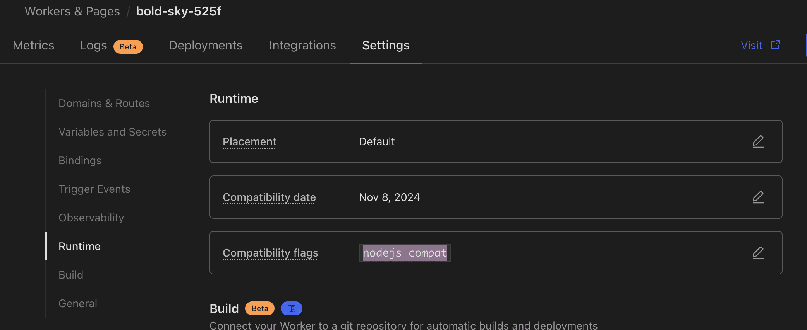

<!-- markdownlint-disable-file MD004 MD024 MD033 MD034 MD036 -->
# CHANGE LOG

<p align="center">
  <a href="CHANGELOG.md">🇨🇳 中文</a> |
  <a href="CHANGELOG_EN.md">🇺🇸 English</a>
</p>

## v1.4.0(main)

### Features

- feat: |User Registration| Add email regex validation for user registration, admins can configure email format validation rules

### Bug Fixes

- fix: |Docs| Fix User Mail API documentation incorrectly using `x-admin-auth`, changed to correct `x-user-token`
- docs: |Docs| Add Admin API documentation for delete mail, delete address, clear inbox, and clear sent items

### Improvements

- style: |Mail List| Improve empty state display for inbox and sent box, show different messages based on mail count, add semantic icons

## v1.3.0

### Features

- feat: |OAuth2| Add email format transformation support for OAuth2, allowing regex-based email format conversion from third-party login providers (e.g., transform `user@domain` to `user@custom.domain`)
- feat: |OAuth2| Add SVG icon support for OAuth2 providers, admins can configure custom icons for login buttons, preset icons for GitHub, Linux Do, Authentik templates
- feat: |Send Mail| Auto-hide sendmail tab, sendbox tab, and reply button when send mail is not configured

### Bug Fixes

- fix: |User Address| Fix address count limit check failure when anonymous creation is disabled for logged-in users, add public function `isAddressCountLimitReached` to unify address count limit logic

### Improvements

- refactor: |Code Refactoring| Extract address count limit check as a public function to improve code reusability
- perf: |Performance| Change address activity time update in GET requests to async execution using `waitUntil`, non-blocking response

## v1.2.1

### Bug Fixes

- fix: |Scheduled Tasks| Fix scheduled task cleanup error `e.get is not a function`, use optional chaining for safe access to Context methods

### Improvements

- style: |AI Extraction| Use softer blue color (#A8C7FA) for AI extraction info in dark mode to reduce eye strain

## v1.2.0

### Breaking Changes

- |Database| Add `source_meta` field, need to execute `db/2025-12-27-source-meta.sql` to update database or click database update button on admin maintenance page

### Features

- feat: |Admin| Add admin account page, display current login method and support logout (password login only)
- fix: |GitHub Actions| Fix container image name must be lowercase
- feat: |Email Forwarding| Add source address regex forwarding, filter by sender address, fully backward compatible
- feat: |Address Source| Add address source tracking feature, record address creation source (Web records IP, Telegram records user ID, Admin panel marked)
- feat: |Email Filtering| Remove backend keyword parameter, switch to frontend filtering of current page emails, optimize query performance
- feat: |Frontend| Unify address switching into a dropdown component, support switching in simple mode, add address management entry on the homepage
- feat: |Database| Add index for `message_id` field to optimize email update operations, need to execute `db/2025-12-15-message-id-index.sql` to update database
- feat: |Admin| Add custom SQL cleanup feature to maintenance page, support scheduled task execution of custom cleanup statements
- feat: |i18n| Backend API error messages now fully support Chinese and English internationalization
- feat: |Telegram| Bot supports Chinese/English switching, add `/lang` command to set language preference

## v1.1.0

- feat: |AI Extraction| Add AI email recognition feature, use Cloudflare Workers AI to automatically extract verification codes, authentication links, service links and other important information from emails
  - Support priority extraction: verification codes > authentication links > service links > subscription links > other links
  - Admin can configure address whitelist (supports wildcards, e.g. `*@example.com`)
  - Frontend list and detail pages display extraction results
  - Need to configure `ENABLE_AI_EMAIL_EXTRACT` environment variable and AI binding
  - Need to execute SQL in `db/2025-12-06-metadata.sql` file to update `D1` database or click database update button on admin maintenance page
- feat: |Admin| Add feature to cleanup addresses with empty mailboxes older than n days on maintenance page
- fix: Fix custom authentication password function issue (frontend property name error & /open_api interface blocked)

## v1.0.7

- feat: |Admin| Add IP blacklist feature for limiting high-frequency API access
- feat: |Admin| Add ASN organization blacklist feature, support filtering requests based on ASN organization name (supports text matching and regex)
- feat: |Admin| Add browser fingerprint blacklist feature, support filtering requests based on browser fingerprint (supports exact matching and regex)

## v1.0.6

- feat: |DB| Update db schema add index
- feat: |Address Password| Add address password login feature, enabled via `ENABLE_ADDRESS_PASSWORD` configuration, need to execute SQL in `db/2025-09-23-patch.sql` file to update `D1` database
- fix: |GitHub Actions| Fix debug mode configuration, only enable debug mode when DEBUG_MODE is 'true'
- feat: |Admin| Account management page adds multi-select batch operations (batch delete, batch clear inbox, batch clear outbox)
- feat: |Admin| Maintenance page adds feature to cleanup unbound user addresses
- feat: Support configuring different bound address quantity limits for different roles, configurable in admin page

## v1.0.5

- feat: Add `DISABLE_CUSTOM_ADDRESS_NAME` configuration: disable custom email address name feature
- feat: Add `CREATE_ADDRESS_DEFAULT_DOMAIN_FIRST` configuration: prioritize first domain when creating addresses
- feat: |UI| Add button to enter minimalist mode on homepage
- feat: |Webhook| Add whitelist switch feature, support flexible access control

## v1.0.4

- feat: |UI| Optimize minimalist mode homepage, add all emails page functionality (delete/download/attachments/...), switchable in `Appearance`
- feat: Admin account settings page adds `Email Forwarding Rules` configuration
- feat: Admin account settings page adds `Reject Unknown Address Emails` configuration
- feat: Email page adds Previous/Next buttons

## v1.0.3

- fix: Fix github actions deployment issue
- feat: telegram /new when domain not specified, use random address

## v1.0.2

- fix: Fix oauth2 login failure issue

## v1.0.1

- feat: |UI| Add minimalist mode homepage, switchable in `Appearance`
- fix: Fix oauth2 login default role not taking effect issue

## v1.0.0

- fix: |UI| Fix User inbox viewing, when address not selected, keyword query not working
- fix: Fix auto cleanup task, time 0 not taking effect issue
- feat: Cleanup feature adds cleanup of addresses created n days ago, cleanup of addresses inactive for n days
- fix: |IMAP Proxy| Fix IMAP Proxy server unable to view new emails issue

## v0.10.0

- feat: Support User inbox viewing, `/user_api/mails` interface, support `address` and `keyword` filtering
- fix: Fix Oauth2 login token retrieval, some Oauth2 require `redirect_uri` parameter issue
- feat: When user accesses webpage, if `user token` expires within 7 days, auto refresh
- feat: Add db initialization feature to admin portal
- feat: Add `ALWAYS_SHOW_ANNOUNCEMENT` variable to configure whether to always show announcements

## v0.9.1

- feat: |UI| Support google ads
- feat: |UI| Use shadow DOM to prevent style pollution
- feat: |UI| Support URL jwt parameter auto-login to mailbox, jwt parameter overrides browser jwt
- fix: |CleanUP| Fix cleanup emails when cleanup time exceeds 30 days error bug
- feat: Admin user management page: add user address viewing feature
- feat: | S3 Attachments| Add S3 attachment deletion feature
- feat: | Admin API| Add admin bind user and address api
- feat: | Oauth2 | When Oauth2 gets user info, support `JSONPATH` expressions

## v0.9.0

- feat: | Worker | Support multi-language
- feat: | Worker | `NO_LIMIT_SEND_ROLE` configuration supports multiple roles, comma separated
- feat: | Actions | Add `worker-with-wasm-mail-parser.zip` in build to support UI deployment with `wasm` worker

## v0.8.7

- fix: |UI| Fix mobile device date display issue
- feat: |Worker| Support sending emails via `SMTP`, using [zou-yu/worker-mailer](https://github.com/zou-yu/worker-mailer/blob/main/README_zh-CN.md)

## v0.8.6

- feat: |UI| Announcements support html format
- feat: |UI| `COPYRIGHT` supports html format
- feat: |Doc| Optimize deployment documentation, supplement `Github Actions Deployment Documentation`, add `Worker Variable Description`

## v0.8.5

- feat: |mail-parser-wasm-worker| Fix `deprecated` parameter warning when calling `initSync` function
- feat: rpc headers convert & typo (#559)
- fix: telegram mail page use iframe show email (#561)
- feat: |Worker| Add `REMOVE_ALL_ATTACHMENT` and `REMOVE_EXCEED_SIZE_ATTACHMENT` for removing email attachments, due to parsing emails some information will be lost, such as images.

## v0.8.4

- fix: |UI| Fix admin portal delete call api error when no recipient email
- feat: |Telegram Bot| Add telegram bot cleanup invalid address credentials command
- feat: Add worker configuration `DISABLE_ANONYMOUS_USER_CREATE_EMAIL` to disable anonymous user email creation, only allow logged-in users to create email addresses
- feat: Add worker configuration `ENABLE_ANOTHER_WORKER` and `ANOTHER_WORKER_LIST`, for calling other worker rpc interfaces (#547)
- feat: |UI| Auto refresh configuration saved to browser, configurable refresh interval
- feat: Spam detection adds check-when-exists list `JUNK_MAIL_CHECK_LIST` configuration
- feat: | Worker | Add `ParsedEmailContext` class for caching parsed email content, reduce parsing times
- feat: |Github Action| Worker deployment adds `DEBUG_MODE` output logging, `BACKEND_USE_MAIL_WASM_PARSER` configuration for whether to use wasm to parse emails

## v0.8.3

- feat: |Github Action| Add auto update and deploy feature
- feat: |UI| Admin user settings, support oauth2 configuration deletion
- feat: Add spam detection must-pass list `JUNK_MAIL_FORCE_PASS_LIST` configuration

## v0.8.2

- fix: |Doc| Fix some documentation errors
- fix: |Github Action| Fix frontend deployment branch error issue
- feat: Admin send email feature
- feat: Admin backend, account configuration page adds unlimited send email address list

## v0.8.1

- feat: |Doc| Update UI installation documentation
- feat: |UI| Hide mailbox account ID from users
- feat: |UI| Add `Forward` button to email detail page

## v0.8.0

- feat: |UI| Random address generation doesn't exceed max length
- feat: |UI| Email time display in browser timezone, can switch to display UTC time in settings
- feat: Support transferring emails to other users

## v0.7.6

### Breaking Changes

UI deployment worker needs to click Settings -> Runtime, modify Compatibility flags, add `nodejs_compat`



### Changes

- feat: Support pre-setting bot info to reduce telegram callback latency (#441)
- feat: Add telegram mini app build archive
- feat: Add whether to enable spam check `ENABLE_CHECK_JUNK_MAIL` configuration

## v0.7.5

- fix: Fix `name` validation check

## v0.7.4

- feat: UI list page adds minimum width
- fix: Fix `name` validation check
- fix: Fix `DEFAULT_DOMAINS` configuration empty not taking effect issue

## v0.7.3

- feat: Worker adds `ADDRESS_CHECK_REGEX`, address name regex, only for checking, matching will pass check
- fix: UI fix login page tab active icon misalignment
- fix: UI fix admin page refresh popup password input issue
- feat: Support `OAuth2` login, can login via `Github` `Authentik` and other third parties, see details [OAuth2 Third-party Login](https://temp-mail-docs.awsl.uk/en/guide/feature/user-oauth2.html)

## v0.7.2

### Breaking Changes

`webhook` structure adds `enabled` field, existing configurations need to be re-enabled and saved on the page.

### Changes

- fix: Worker adds `NO_LIMIT_SEND_ROLE` configuration, loading failure issue
- feat: Worker adds `# ADDRESS_REGEX = "[^a-z.0-9]"` configuration, regex for replacing illegal symbols, if not set, defaults to [^a-z0-9], use with caution, some symbols may cause receiving issues
- feat: Worker optimizes webhook logic, supports admin configuring global webhook, adds `message pusher` integration example

## v0.7.1

- fix: Fix user role loading failure issue
- feat: Admin account settings adds source email address blacklist configuration

## v0.7.0

### Breaking Changes

DB changes: Add user `passkey` table, need to execute `db/2024-08-10-patch.sql` to update `D1` database

### Changes

- Docs: Update new-address-api.md (#360)
- feat: Worker adds `ADMIN_USER_ROLE` configuration, for configuring admin user role, users with this role can access admin management page (#363)
- feat: Worker adds `DISABLE_SHOW_GITHUB` configuration, for configuring whether to show github link
- feat: Worker adds `NO_LIMIT_SEND_ROLE` configuration, for configuring roles that can send unlimited emails
- feat: User adds `passkey` login method, for user login, no password required
- feat: Worker adds `DISABLE_ADMIN_PASSWORD_CHECK` configuration, for configuring whether to disable admin console password check, if your site is only privately accessible, you can disable the check

## v0.6.1

- pages github actions && fix cleanup emails days 0 not taking effect by @tqjason (#355)
- fix: imap proxy server doesn't support password by @dreamhunter2333 (#356)
- worker adds `ANNOUNCEMENT` configuration, for configuring announcement info by @dreamhunter2333 (#357)
- fix: telegram bot create new address defaults to first domain by @dreamhunter2333 (#358)

## v0.6.0

### Breaking Changes

DB changes: Add user role table, need to execute `db/2024-07-14-patch.sql` to update `D1` database

### Changes

Worker configuration file adds `DEFAULT_DOMAINS`, `USER_ROLES`, `USER_DEFAULT_ROLE`, see documentation [worker configuration](https://temp-mail-docs.awsl.uk/en/guide/cli/worker.html)

- Remove `apiV1` related code and related database tables
- Update `admin/statistics` api, add user statistics info
- Update address rules, only allow lowercase+numbers, for historical addresses `lowercase` processing will be performed when querying emails
- Add user role feature, `admin` can set user roles (currently can configure domain and prefix for each role)
- Admin page search optimization, enter key auto search, input content auto trim

## v0.5.4

- Click logo 5 times to enter admin page
- Fix 401 cannot redirect to login page (admin and site authentication)

## v0.5.3

- Fix some bugs in smtp imap proxy server
- Improve user/admin delete inbox/outbox functionality
- Admin can delete send permission records
- Add Chinese email alias configuration `DOMAIN_LABELS` [documentation](https://temp-mail-docs.awsl.uk/en/guide/cli/worker.html)
- Remove `mail channels` related code
- github actions adds `FRONTEND_BRANCH` variable to specify deployment branch (#324)

## v0.5.1

- Add `mail-parser-wasm-worker` for worker email parsing, [documentation](https://temp-mail-docs.awsl.uk/en/guide/feature/mail_parser_wasm_worker.html)
- Add user email length validation configuration `MIN_ADDRESS_LEN` and `MAX_ADDRESS_LEN`
- Fix `pages function` not forwarding `telegram` api issue

## v0.5.0

- UI: Add local cache for address management
- worker: Add `FORWARD_ADDRESS_LIST` global email forwarding address (equivalent to `catch all`)
- UI: Multi-language uses routing for switching
- Add save attachments to S3 feature
- UI: Add received email list `batch delete` and `batch download`

## v0.4.6

- Worker configuration file adds `TITLE = "Custom Title"`, can customize website title
- Fix KV not bound unable to delete address issue

## v0.4.5

- UI lazy load
- telegram bot adds user global push feature (admin users)
- Add support for cloudflare verified user sending emails
- Add using `resend` to send emails, `resend` provides http and smtp api, easier to use, documentation: https://temp-mail-docs.awsl.uk/en/guide/config-send-mail.html

## v0.4.4

- Add telegram mini app
- telegram bot adds `unbind`, `delete` commands
- Fix webhook multiline text issue

## v0.4.3

### Breaking Changes

Configuration file `main = "src/worker.js"` changed to `main = "src/worker.ts"`

### Changes

- `telegram bot` whitelist configuration
- `ENABLE_WEBHOOK` add webhook
- UI: admin page uses two-level tabs
- UI: can directly switch addresses on homepage after login
- UI: outbox also uses split view display (similar to inbox)
- `SMTP IMAP Proxy` add outbox viewing

* feat: telegram bot TelegramSettings && webhook by @dreamhunter2333 in https://github.com/dreamhunter2333/cloudflare_temp_email/pull/244
* fix build by @dreamhunter2333 in https://github.com/dreamhunter2333/cloudflare_temp_email/pull/245
* feat: UI changes by @dreamhunter2333 in https://github.com/dreamhunter2333/cloudflare_temp_email/pull/247
* feat: SMTP IMAP Proxy: add sendbox && UI: sendbox use split view by @dreamhunter2333 in https://github.com/dreamhunter2333/cloudflare_temp_email/pull/248

## v0.4.2

- Fix some bugs in smtp imap proxy server
- Fix UI interface text errors, interface adds version number
- Add telegram bot documentation https://temp-mail-docs.awsl.uk/en/guide/feature/telegram.html

* fix: imap server by @dreamhunter2333 in https://github.com/dreamhunter2333/cloudflare_temp_email/pull/227
* fix: Maintenance wrong label by @dreamhunter2333 in https://github.com/dreamhunter2333/cloudflare_temp_email/pull/229
* feat: add version for frontend && backend by @dreamhunter2333 in https://github.com/dreamhunter2333/cloudflare_temp_email/pull/230
* feat: add page functions proxy to make response faster by @dreamhunter2333 in https://github.com/dreamhunter2333/cloudflare_temp_email/pull/234
* feat: add about page by @dreamhunter2333 in https://github.com/dreamhunter2333/cloudflare_temp_email/pull/235
* feat: remove mailV1Alert && fix mobile showSideMargin by @dreamhunter2333 in https://github.com/dreamhunter2333/cloudflare_temp_email/pull/236
* feat: telegram bot by @dreamhunter2333 in https://github.com/dreamhunter2333/cloudflare_temp_email/pull/238
* fix: remove cleanup address due to many table need to be clean by @dreamhunter2333 in https://github.com/dreamhunter2333/cloudflare_temp_email/pull/240
* feat: docs: Telegram Bot by @dreamhunter2333 in https://github.com/dreamhunter2333/cloudflare_temp_email/pull/241
* fix: smtp_proxy: cannot decode 8bit && tg bot new random address by @dreamhunter2333 in https://github.com/dreamhunter2333/cloudflare_temp_email/pull/242
* fix: smtp_proxy: update raise imap4.NoSuchMailbox by @dreamhunter2333 in https://github.com/dreamhunter2333/cloudflare_temp_email/pull/243

### v0.4.1

- Username limited to max 30 characters
- Fix `/external/api/send_mail` not returning bug (#222)
- Add `IMAP proxy` service, support `IMAP` viewing emails
- UI interface adds version number display

* feat: use common function handleListQuery when query by page by @dreamhunter2333 in https://github.com/dreamhunter2333/cloudflare_temp_email/pull/220
* fix: typos by @lwd-temp in https://github.com/dreamhunter2333/cloudflare_temp_email/pull/221
* fix: name max 30 && /external/api/send_mail not return result by @dreamhunter2333 in https://github.com/dreamhunter2333/cloudflare_temp_email/pull/222
* fix: smtp_proxy_server support decode from mail charset by @dreamhunter2333 in https://github.com/dreamhunter2333/cloudflare_temp_email/pull/223
* feat: add imap proxy server by @dreamhunter2333 in https://github.com/dreamhunter2333/cloudflare_temp_email/pull/225
* feat: UI show version by @dreamhunter2333 in https://github.com/dreamhunter2333/cloudflare_temp_email/pull/226

### New Contributors

* @lwd-temp made their first contribution in https://github.com/dreamhunter2333/cloudflare_temp_email/pull/221

## v0.4.0

### DB Changes/Breaking changes

Added user related tables for storing user information

- `db/2024-05-08-patch.sql`

### config changes

Enable user registration email verification requires `KV`

```toml
# kv config for send email verification code
# [[kv_namespaces]]
# binding = "KV"
# id = "xxxx"
```

### function changes

- Add user registration feature, can bind email addresses, automatically obtain email JWT credentials after binding
- Add default text display for emails, text and HTML email display mode switch button
- Fix `BUG` randomly generated email names are invalid #211
- `admin` email page supports email content search #210
- Fix bug where emails weren't deleted when deleting addresses #213
- UI adds global tab position configuration, side margin configuration

* feat: update docs by @dreamhunter2333 in https://github.com/dreamhunter2333/cloudflare_temp_email/pull/204
* feat: add Deploy to Cloudflare Workers button by @dreamhunter2333 in https://github.com/dreamhunter2333/cloudflare_temp_email/pull/205
* feat: add Deploy to Cloudflare Workers docs by @dreamhunter2333 in https://github.com/dreamhunter2333/cloudflare_temp_email/pull/206
* feat: add UserLogin by @dreamhunter2333 in https://github.com/dreamhunter2333/cloudflare_temp_email/pull/209
* feat: admin search mailbox && fix generateName multi dot && user jwt exp in 30 days && UI globalTabplacement && useSideMargin by @dreamhunter2333 in https://github.com/dreamhunter2333/cloudflare_temp_email/pull/214
* feat: UI check openSettings in Login page by @dreamhunter2333 in https://github.com/dreamhunter2333/cloudflare_temp_email/pull/215
* feat: UI move AdminContact to common by @dreamhunter2333 in https://github.com/dreamhunter2333/cloudflare_temp_email/pull/217
* feat: docs by @dreamhunter2333 in https://github.com/dreamhunter2333/cloudflare_temp_email/pull/218

## v0.3.3

- Fix Admin delete email error
- UI: Reply email button, quote original email text #186
- Add send email address blacklist
- Add `CF Turnstile` CAPTCHA configuration
- Add `/external/api/send_mail` send email api, use body verification #194

## v0.3.2

## What's Changed

- UI: Add reply email button
- Add scheduled cleanup feature, configurable in admin page (need to enable scheduled task in config file)
- Fix delete account no response issue

* feat: UI: MailBox add reply button by @dreamhunter2333 in https://github.com/dreamhunter2333/cloudflare_temp_email/pull/187
* feat: add cron auto clean up by @dreamhunter2333 in https://github.com/dreamhunter2333/cloudflare_temp_email/pull/189
* fix: delete account by @dreamhunter2333 in https://github.com/dreamhunter2333/cloudflare_temp_email/pull/190

## v0.3.1

### DB Changes

Added `settings` table for storing general configuration information

- `db/2024-05-01-patch.sql`

### Changes

- `ENABLE_USER_CREATE_EMAIL` whether to allow users to create emails
- Allow admin to create emails without prefix
- Add `SMTP proxy server`, support SMTP sending emails
- Fix some cases where browsers can't load `wasm` use js to parse emails
- Footer adds `COPYRIGHT`
- UI allows users to switch email display mode `v-html` / `iframe`
- Add `admin` account configuration page, support configuring user registration name blacklist

* feat: support admin create address && add ENABLE_USER_CREATE_EMAIL co… by @dreamhunter2333 in https://github.com/dreamhunter2333/cloudflare_temp_email/pull/175
* feat: add SMTP proxy server by @dreamhunter2333 in https://github.com/dreamhunter2333/cloudflare_temp_email/pull/177
* fix: cf ui var is string by @dreamhunter2333 in https://github.com/dreamhunter2333/cloudflare_temp_email/pull/178
* fix: UI mailbox 100vh to 80vh by @dreamhunter2333 in https://github.com/dreamhunter2333/cloudflare_temp_email/pull/179
* fix: smtp_proxy_server hostname && add docker image for linux/arm64 by @dreamhunter2333 in https://github.com/dreamhunter2333/cloudflare_temp_email/pull/180
* fix: some browser do not support wasm by @dreamhunter2333 in https://github.com/dreamhunter2333/cloudflare_temp_email/pull/182
* feat: add COPYRIGHT by @dreamhunter2333 in https://github.com/dreamhunter2333/cloudflare_temp_email/pull/183
* feat: UI: add user page: useIframeShowMail && mailboxSplitSize by @dreamhunter2333 in https://github.com/dreamhunter2333/cloudflare_temp_email/pull/184
* feat: add address_block_list for new address by @dreamhunter2333 in https://github.com/dreamhunter2333/cloudflare_temp_email/pull/185

## v0.3.0

### Breaking Changes

The prefix of the `address` table will migrate from code to db, please replace `tmp` in the sql below with your prefix, then execute.
If your data is important, please backup your database first.

**Note: Replace prefix**

```sql
update
    address
set
    name = 'tmp' || name;
```

### Changes

- Migrate the prefix of the `address` table from code to db
- `admin` account page adds send/receive email counts
- `admin` outbox page defaults to show all
- `admin` send permission page supports search by address
- `admin` email page uses split view UI

* feat: remove PREFIX logic in db by @dreamhunter2333 in https://github.com/dreamhunter2333/cloudflare_temp_email/pull/171
* feat: admin page add account mail count && sendbox default all && sen… by @dreamhunter2333 in https://github.com/dreamhunter2333/cloudflare_temp_email/pull/172
* feat: all mail use MailBox Component by @dreamhunter2333 in https://github.com/dreamhunter2333/cloudflare_temp_email/pull/173

**Full Changelog**: https://github.com/dreamhunter2333/cloudflare_temp_email/compare/0.2.10...v0.3.0

## v0.2.10

- `ENABLE_USER_DELETE_EMAIL` whether to allow users to delete account and emails
- `ENABLE_AUTO_REPLY` whether to enable auto reply
- fetchAddressError prompt improvement
- Auto refresh shows countdown

* feat: docs update by @dreamhunter2333 in https://github.com/dreamhunter2333/cloudflare_temp_email/pull/165
* feat: add ENABLE_USER_DELETE_EMAIL && ENABLE_AUTO_REPLY && modify fetchAddressError i18n && UI: show autoRefreshInterval by @dreamhunter2333 in https://github.com/dreamhunter2333/cloudflare_temp_email/pull/169

## v0.2.9

- Add rich text editor
- Admin contact info, won't show if not configured, can configure any string `ADMIN_CONTACT = "xx@xx.xxx"`
- Default send email balance, if not set, will be 0 `DEFAULT_SEND_BALANCE = 1`

## v0.2.8

- Allow users to delete emails
- Admin notifies user by email when modifying send permissions
- Send permission defaults to 1
- Add RATE_LIMITER rate limiting for sending emails and creating new addresses
- Some bug fixes

- feat: allow user delete mail && notify when send access changed by @dreamhunter2333 in https://github.com/dreamhunter2333/cloudflare_temp_email/pull/132
- feat: request_send_mail_access default 1 balance by @dreamhunter2333 in https://github.com/dreamhunter2333/cloudflare_temp_email/pull/143
- fix: RATE_LIMITER not call jwt by @dreamhunter2333 in https://github.com/dreamhunter2333/cloudflare_temp_email/pull/146
- fix: delete_address not delete address_sender by @dreamhunter2333 in https://github.com/dreamhunter2333/cloudflare_temp_email/pull/153
- fix: send_balance not update when click sendmail by @dreamhunter2333 in https://github.com/dreamhunter2333/cloudflare_temp_email/pull/155

## v0.2.7

- Added user interface installation documentation
- Support email DKIM
- Rate limiting configuration for `/api/new_address`

## v0.2.6

- Added admin query outbox page
- Add admin data cleaning page

## 2024-04-12 v0.2.5

- Support send email

DB changes:

- `db/2024-04-12-patch.sql`

## 2024-04-10 v0.2.0

### Breaking Changes

- remove `ENABLE_ATTACHMENT` config
- use rust wasm to parse email in frontend
- deprecated api moved to `/api/v1`

### Rust Mail Parser

Due to some problems with nodejs' email parsing library, this version switches to using rust wasm to call rust's mail parsing library.

- Faster speed, good attachment support, can display attachment images of emails
- Parsing supports more rfc specifications

### DB changes

The `mails` table will be discarded, and the `raw` text of the new `mail` will be directly stored in the `raw_mails` table

## Upgrade Step

```bash
git checkout v0.2.0
cd worker
wrangler d1 execute dev  --file=../db/2024-04-09-patch.sql --remote
pnpm run deploy
cd ../frontend
pnpm run deploy
```

Note: For historical messages, use the Deploy New web page to view old data.

```bash
git checkout feature/backup
cd frontend
# Create a new pages for accessing old data
pnpm run deploy --project-name temp-email-v1
```

## 2024-04-09 v0.0.0

release v0.0.0

## 2024-04-03

DB changes

- `db/2024-04-03-patch.sql`

Changes:

- add delete account
- add admin panel search

## 2024-01-13

DB changes

- `db/2024-01-13-patch.sql`
