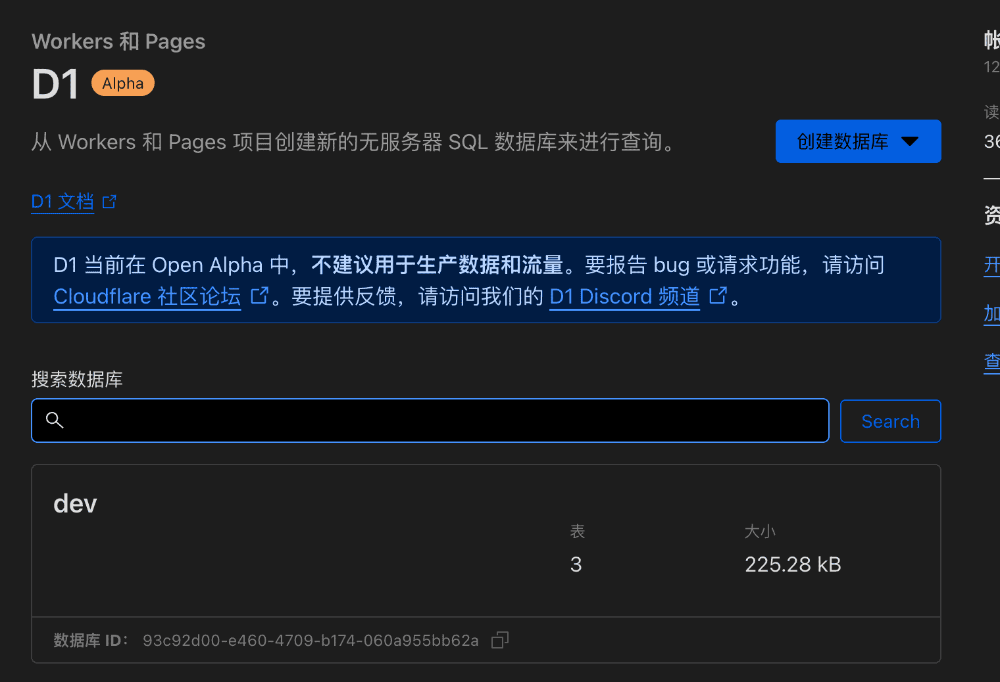
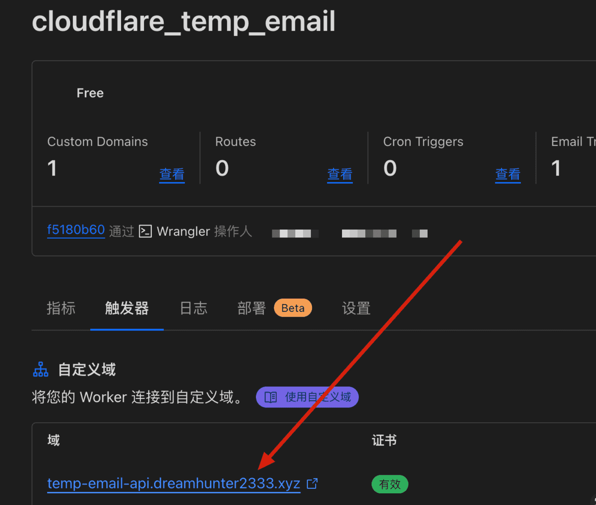
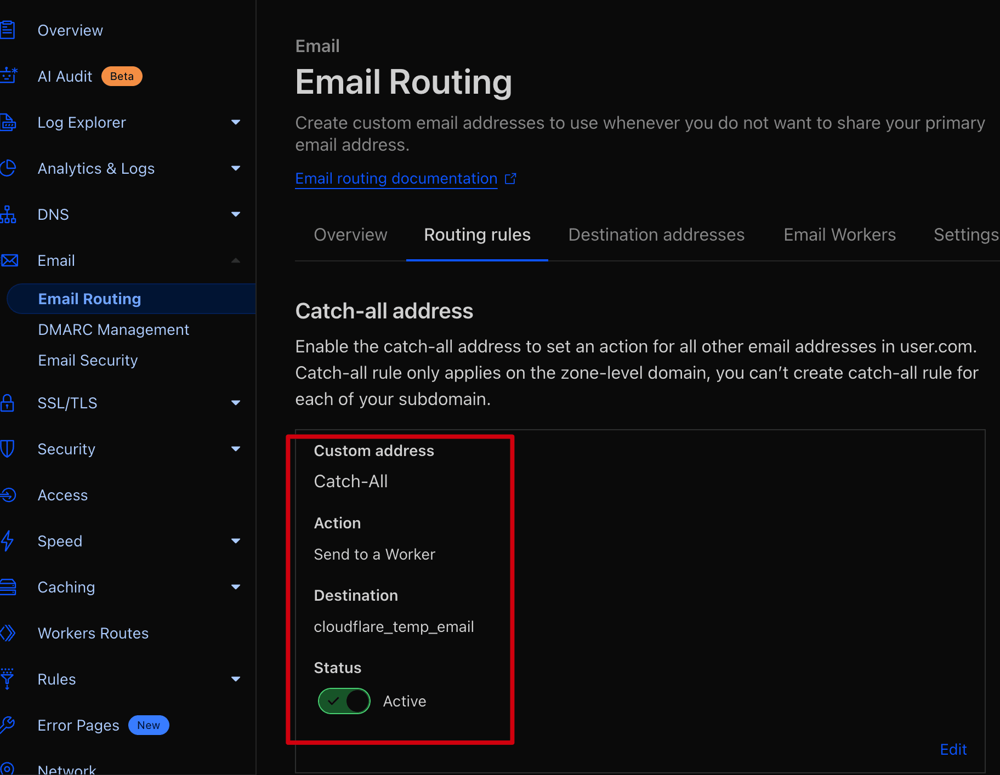
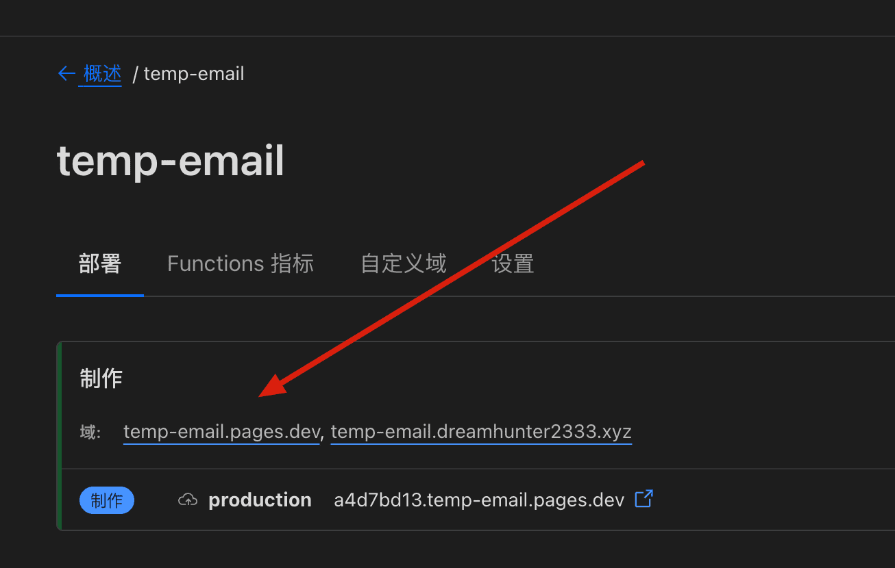

# 使用 cloudflare 免费服务，搭建临时邮箱

## [查看部署文档](https://temp-mail-docs.awsl.uk)

## [English](https://temp-mail-docs.awsl.uk/en/)

## [CHANGELOG](CHANGELOG.md)

## [在线演示](https://mail.awsl.uk/)

|                                            |                                                                                                                                                                                                                                                                                                                                                                                                                                                                                                                                                                                |
| ------------------------------------------ | ------------------------------------------------------------------------------------------------------------------------------------------------------------------------------------------------------------------------------------------------------------------------------------------------------------------------------------------------------------------------------------------------------------------------------------------------------------------------------------------------------------------------------------------------------------------------------ |
| [Backend](https://temp-email-api.awsl.uk/) | [](https://github.com/dreamhunter2333/cloudflare_temp_email/actions/workflows/backend_deploy.yaml)       |
| [Frontend](https://mail.awsl.uk/)          | [](https://github.com/dreamhunter2333/cloudflare_temp_email/actions/workflows/frontend_deploy.yaml)               |

<picture>
  <source media="(prefers-color-scheme: dark)" srcset="https://api.star-history.com/svg?repos=dreamhunter2333/cloudflare_temp_email&type=Date&theme=dark" />
  <source media="(prefers-color-scheme: light)" srcset="https://api.star-history.com/svg?repos=dreamhunter2333/cloudflare_temp_email&type=Date" />
  
</picture>

- [使用 cloudflare 免费服务，搭建临时邮箱](#使用-cloudflare-免费服务搭建临时邮箱)
  - [查看部署文档](#查看部署文档)
  - [English](#english)
  - [CHANGELOG](#changelog)
  - [在线演示](#在线演示)
  - [功能/TODO](#功能todo)
  - [什么是临时邮箱](#什么是临时邮箱)
  - [Cloudflare 服务](#cloudflare-服务)
  - [wrangler 的安装](#wrangler-的安装)
  - [D1 数据库](#d1-数据库)
  - [Cloudflare workers 后端](#cloudflare-workers-后端)
  - [Cloudflare Email Routing](#cloudflare-email-routing)
  - [Cloudflare Pages 前端](#cloudflare-pages-前端)
  - [配置发送邮件](#配置发送邮件)
  - [配置 DKIM](#配置-dkim)
  - [参考资料](#参考资料)

## 功能/TODO

- [x] Cloudflare D1 作为数据库
- [x] 使用 Cloudflare Pages 部署前端
- [x] 使用 Cloudflare Workers 部署后端
- [x] email 转发使用 Cloudflare Email Routing
- [x] 使用 password 重新登录之前的邮箱
- [x] 获取自定义名字的邮箱
- [x] 支持多语言
- [x] 增加访问授权，可作为私人站点
- [x] 增加自动回复功能
- [x] 增加查看附件功能
- [x] 使用 rust wasm 解析邮件
- [x] 支持发送邮件
- [x] 支持 DKIM

---

## 什么是临时邮箱

临时邮箱，也被称为一次性邮箱或临时邮件地址，是一种用于临时接收邮件的虚拟邮箱。与常规邮箱不同，临时邮箱旨在提供一种匿名且临时的邮件接收解决方案。

临时邮箱往往由网站或在线服务提供商提供，用户可以在需要注册或接收验证邮件时使用临时邮箱地址，而无需暴露自己的真实邮箱地址。这样做的好处是可以保护个人隐私

---

## Cloudflare 服务

- `D1` 是 `Cloudflare` 的原生无服务器数据库。
- `Pages` 是 `Cloudflare` 的静态网站托管服务, 速度超快，始终保持最新状态。
- `Workers` 是 `Cloudflare` 的 `serverless` 应用服务，可以在全球 300 个数据中心运行代码, 而无需配置或维护基础架构。
- `Cloudflare Email Routing` 可以处理域名的所有电子邮件流量，而无需管理电子邮件服务器。

---

## wrangler 的安装

安装 wrangler

```bash
npm install wrangler -g
```

克隆项目

```bash
git clone https://github.com/dreamhunter2333/cloudflare_temp_email.git
# 切换到最新 tag 或者你想部署的分支，你也可以直接使用 main 分支
# git checkout $(git describe --tags $(git rev-list --tags --max-count=1))
```

---

## D1 数据库

第一次执行登录 wrangler 命令时，会提示登录, 按提示操作即可

```bash
# 创建 D1 并执行 schema.sql
wrangler d1 create dev
wrangler d1 execute dev --file=db/schema.sql
# schema 更新，如果你在此日期之前初始化过数据库，可以执行此命令更新
# wrangler d1 execute dev --file=db/2024-01-13-patch.sql
# wrangler d1 execute dev --file=db/2024-04-03-patch.sql
```

创建完成后，我们在 cloudflare 的控制台可以看到 D1 数据库



---

## Cloudflare workers 后端

初始化项目

```bash
cd worker
pnpm install
cp wrangler.toml.template wrangler.toml
```

修改 `wrangler.toml` 文件

```bash
name = "cloudflare_temp_email"
main = "src/worker.js"
compatibility_date = "2023-08-14"
node_compat = true

[vars]
PREFIX = "tmp" # 要处理的邮箱名称前缀
# 如果你想要你的网站私有，取消下面的注释，并修改密码
# PASSWORDS = ["123", "456"]
# admin 控制台密码, 不配置则不允许访问控制台
# ADMIN_PASSWORDS = ["123", "456"]
DOMAINS = ["xxx.xxx1" , "xxx.xxx2"] # 你的域名
JWT_SECRET = "xxx" # 用于生成 jwt 的密钥
BLACK_LIST = "" # 黑名单，用于过滤发件人，逗号分隔
# dkim config
# DKIM_SELECTOR = "mailchannels" # 参考 DKIM 部分 mailchannels._domainkey 的 mailchannels
# DKIM_PRIVATE_KEY = "" # 参考 DKIM 部分 priv_key.txt 的内容

[[d1_databases]]
binding = "DB"
database_name = "xxx" # D1 数据库名称
database_id = "xxx" # D1 数据库 ID

# 新建地址限流配置
# [[unsafe.bindings]]
# name = "RATE_LIMITER"
# type = "ratelimit"
# namespace_id = "1001"
# # 10 requests per minute
# simple = { limit = 10, period = 60 }
```

部署

第一次部署会提示创建项目, `production` 分支请填写 `production`

```bash
pnpm run deploy
```

部署成功之后再路由中可以看到 `worker` 的 `url`，控制台也会输出 `worker` 的 `url`



---

## Cloudflare Email Routing

在将电子邮件地址绑定到您的 Worker 之前，您需要启用电子邮件路由并拥有至少一个经过验证的电子邮件地址。

配置对应域名的 `电子邮件 DNS 记录`

配置 `Cloudflare Email Routing` catch-all 发送到 `worker`



---

## Cloudflare Pages 前端

第一次部署会提示创建项目, `production` 分支请填写 `production`

```bash
cd frontend
pnpm install
cp .env.example .env.local
```

修改 `.env.local` 文件, 将 `VITE_API_BASE` 修改为 `worker` 的 `url`, 不要在末尾加 `/`

例如: `VITE_API_BASE=https://xxx.xxx.workers.dev`

```bash
pnpm build --emptyOutDir
# 根据提示创建 pages
pnpm run deploy
```



## 配置发送邮件

找到域名 `DNS` 记录的 `TXT` 的 `SPF` 记录, 增加 `include:relay.mailchannels.net`

```bash
v=spf1 include:_spf.mx.cloudflare.net include:relay.mailchannels.net ~all
```

新建 `_mailchannels` 记录, 类型为 `TXT`, 内容为 `v=mc1 cfid=你的worker域名`

- 此处 worker 域名为后端 api 的域名，比如我部署在 `https://temp-email-api.awsl.uk/`，则填写 `v=mc1 cfid=awsl.uk`
- 如果你的域名是 `https://temp-email-api.xxx.workers.dev`，则填写 `v=mc1 cfid=xxx.workers.dev`

## 配置 DKIM

参考: [Adding-a-DKIM-Signature](https://support.mailchannels.com/hc/en-us/articles/7122849237389-Adding-a-DKIM-Signature)

Creating a DKIM private and public key:
Private key as PEM file and base64 encoded txt file:

```bash
openssl genrsa 2048 | tee priv_key.pem | openssl rsa -outform der | openssl base64 -A > priv_key.txt
```

Public key as DNS record:

```bash
echo -n "v=DKIM1;p=" > pub_key_record.txt && \
openssl rsa -in priv_key.pem -pubout -outform der | openssl base64 -A >> pub_key_record.txt
```

在 `Cloudflare` 的 `DNS` 记录中添加 `TXT` 记录

- `_dmarc`: `v=DMARC1; p=none; adkim=r; aspf=r;`
- `mailchannels._domainkey`: `v=DKIM1; p=<content of the file pub_key_record.txt>`

## 参考资料

- https://developers.cloudflare.com/d1/
- https://developers.cloudflare.com/pages/
- https://developers.cloudflare.com/workers/
- https://developers.cloudflare.com/email-routing/
