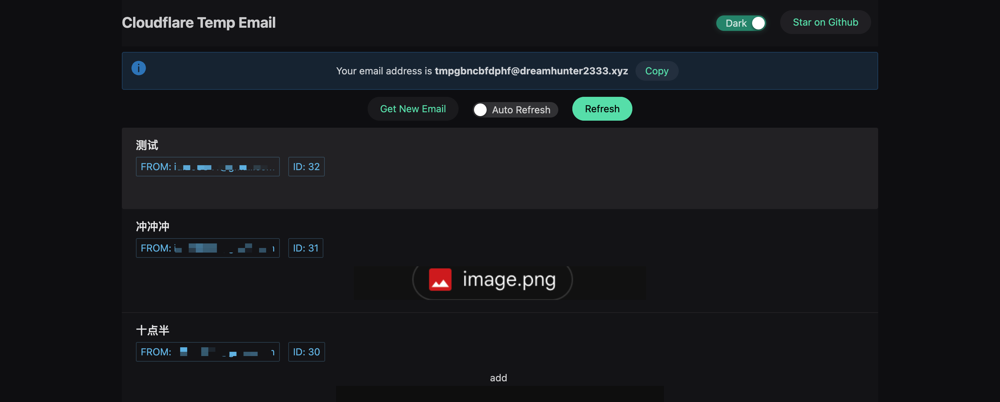

# cloudflare temp email

## [中文](README.md)

## [Live Demo](https://temp-email.dreamhunter2333.xyz/)

This is a temporary email service that uses Cloudflare Workers to create a temporary email address and view the received email in web browser.

## Features

- [x] Cloudflare D1 as a database
- [x] Deploy the front end with Cloudflare Pages
- [x] Deploy the backend with Cloudflare Workers
- [x] Email forwarding using Cloudflare Email Routing
- [x] Use password to login to the previous mailbox again.
- [x] Get Custom Name Email
- [x] Support multiple languages
- [x] Add access authorization, which can be used as a private site
- [x] Add auto reply feature
- [x] Add attachment viewing function
- [ ] Exceeded CPU Limit error caused by the free version of the attachment



## Deploy

[Install/Update Wrangler](https://developers.cloudflare.com/workers/wrangler/install-and-update/)

## DB - Cloudflare D1

```bash
# create a database, and copy the output to wrangler.toml in the next step
wrangler d1 create dev
wrangler d1 execute dev --file=db/schema.sql
```


### Backend - Cloudflare workers

```bash
cd worker
pnpm install
# copy wrangler.toml.template to wrangler.toml
# and add your d1 config and these config
# PREFIX = "tmp" - the email create will be like tmp<xxxxx>@DOMAIN
# IF YOU WANT TO MAKE YOUR SITE PRIVATE, UNCOMMENT THE FOLLOWING LINES
# PASSWORDS = ["123", "456"]
# For admin panel
# ADMIN_PASSWORDS = ["123", "456"]
# DOMAINS = ["xxx.xxx1" , "xxx.xxx2"] you domain name
# JWT_SECRET = "xxx"
# BLACK_LIST = ""
cp wrangler.toml.template wrangler.toml
# deploy
pnpm run deploy
```

you can find and test the worker's url in the  workers dashboard


enable email route and config email forward catch-all to the worker


### Frontend - Cloudflare pages

```bash
cd frontend
pnpm install
# add .env.local and modify VITE_API_BASE to your worker's url
# VITE_API_BASE=https://xxx.xxx.workers.dev - don't put / in the end
cp .env.example .env.local
pnpm build --emptyOutDir
pnpm run deploy
```


